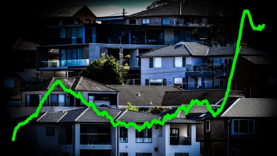
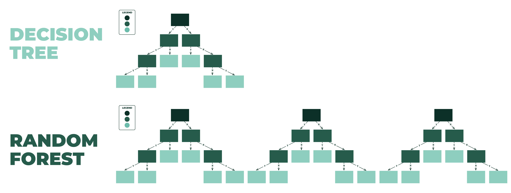
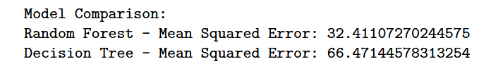

# Random Forest and Decision Trees for House Price Prediction

This is an extension project of [HousePredAlgo](https://github.com/stevemats/HousePredAlgo) - <i>[read its description](https://github.com/stevemats/HousePredAlgo/blob/main/README.md)</i>, whereby I now explore the use of Random Forest and Decision Trees classifiers to predict house prices based on the previous mentioned features. I'll also evaluate the performance of both models using metrics such as MSE, MAE, and RMSE to determine which model is better suited for analyzing the data.

## Dataset

The dataset used for this project is stored in a CSV file named "Real estate.csv" under the "[Dataset](https://github.com/stevemats/RfDtClassifier/tree/main/Dataset)" folder which was ported from [HousePredAlgo](https://github.com/stevemats/HousePredAlgo)- refer to it for further description.

## Random Forest and Decision Trees

### Random Forest

Random Forest is an ensemble learning technique that builds multiple decision trees during training and combines their predictions through averaging or voting to improve the overall performance. It offers flexibility, robustness, and high accuracy, making it suitable for various regression tasks.

### Decision Trees

Decision Trees are simple yet powerful models that recursively partition the feature space into regions, aiming to minimize impurity or maximize information gain at each split. Decision Trees are interpretable and easy to visualize, making them suitable for smaller datasets and providing insights into feature importance.

## Model Evaluation

I'll train Random Forest and Decision Trees classifiers on the dataset and evaluate their performance using MSE, MAE, and RMSE. Additionally, I'll visualize the predicted vs actual house prices for both models to provide a clear comparison of their performance.

## Results

After evaluating the models, I'll compare their performance based on Mean Squared Error (MSE). The model with lower MSE is preferred for analyzing the data.

Based on the MSE comparison, I'll determine whether Random Forest or Decision Trees are preferred for analyzing the data described. Additionally, insights into the performance of both models and their suitability for the house price prediction task will be provided.

---

## Final Report

You can now view the final report which is available under the "[Report](https://github.com/stevemats/RfDtClassifier/blob/main/Report/Report.pdf)" folder📁.
